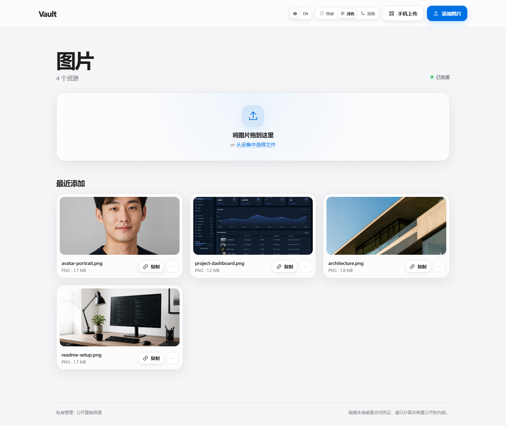
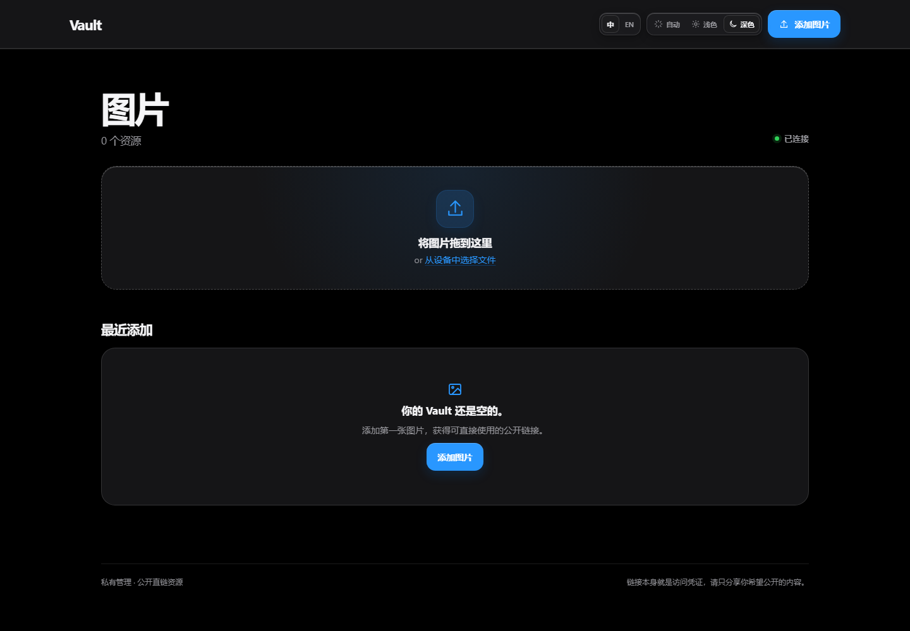
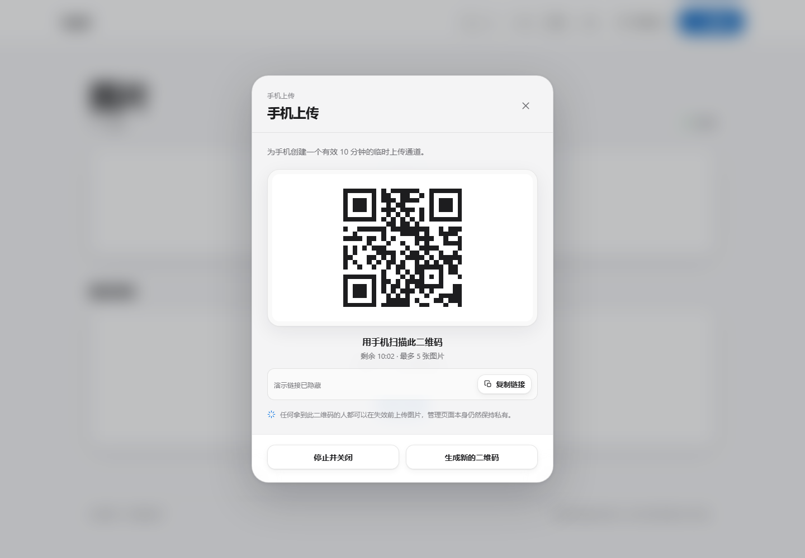
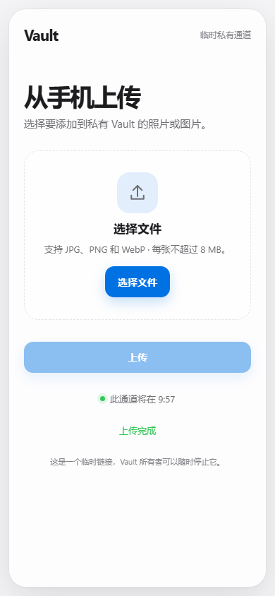
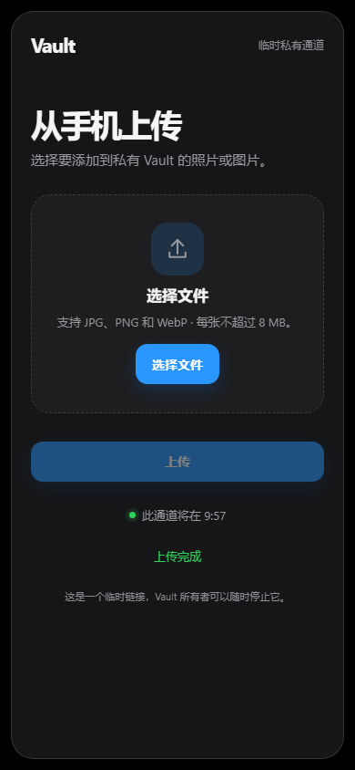
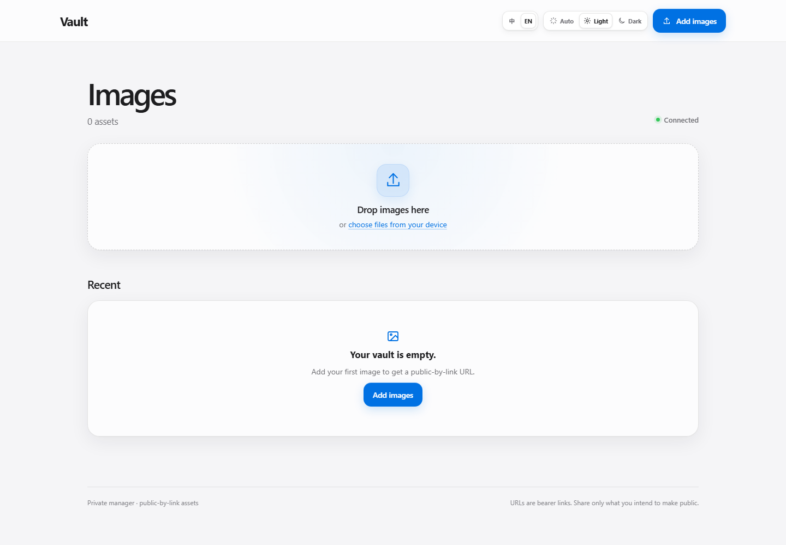
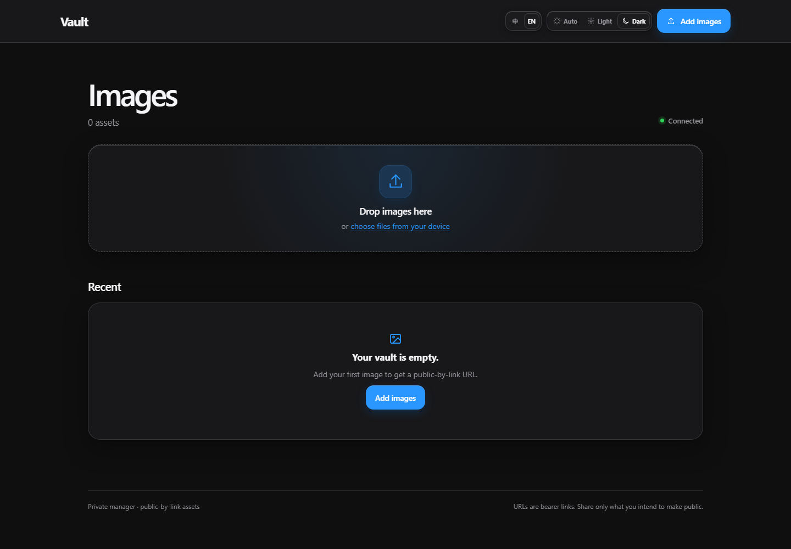
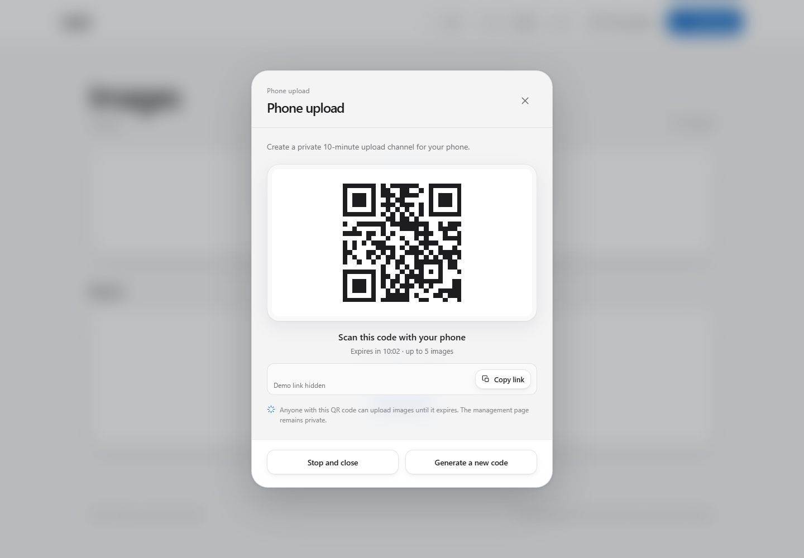
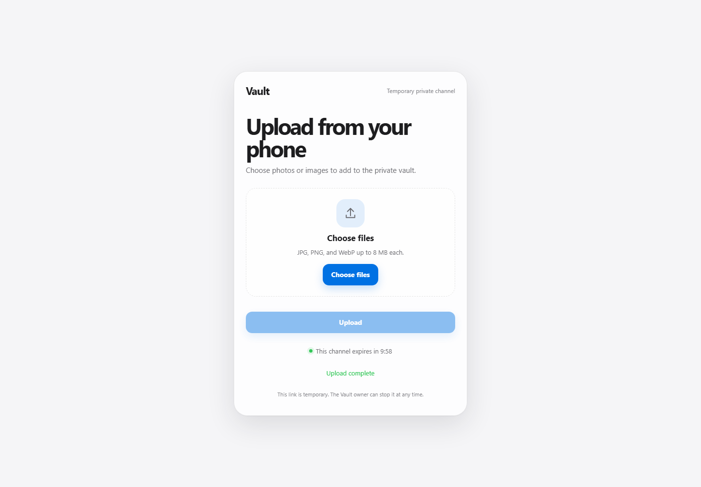
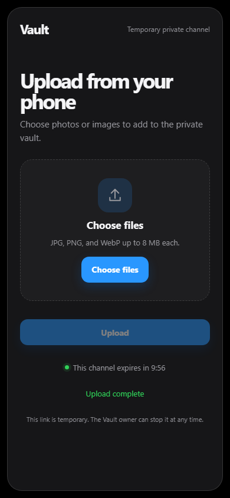

<div align="center">

# 🗂️ Image Vault

### 管理个人图片资产的轻量工作站

### A lightweight workstation for personal image assets

管理端私有 · 图片按完整链接公开 · 不可枚举的随机 URL · 临时二维码手机上传

Owner-only admin · public-by-link images · unguessable URLs · short-lived QR phone upload

[快速开始](#先给-agent--start-with-an-agent) · [中文完整说明](README.zh-CN.md) · [English guide](README.en.md) · [Pages 演示](https://rethymus.github.io/image-vault/)

</div>

---

## 先给 Agent / Start with an Agent

本项目支持手动部署，也提供一个可选的 Agent 辅助复刻入口。入口文档的组织方式参考了 [Agent-Reach](https://github.com/Panniantong/Agent-Reach) 的 raw 文档模式；这只是文档组织上的参考，不表示 Image Vault 与 Agent-Reach 存在功能适配、集成或依赖关系。把下面的一句话直接复制给 Codex、Claude Code、Cursor、Windsurf 或其他实现 Agent，它会在当前工作区内复刻，不需要先拉取整个仓库：

This project can be deployed manually and also provides an optional Agent-assisted reproduction entrypoint. Its document organization takes inspiration from [Agent-Reach](https://github.com/Panniantong/Agent-Reach)'s raw-document pattern; this does not mean that Image Vault is functionally compatible with, integrated with, or dependent on Agent-Reach. Copy one line to an implementation Agent; it reproduces the workstation in the current workspace without first cloning this repository:

```text
帮我复刻 Image Vault 图片工作站：https://raw.githubusercontent.com/Rethymus/image-vault/main/docs/install.md
```

```text
Help me reproduce the Image Vault workstation: https://raw.githubusercontent.com/Rethymus/image-vault/main/docs/install.md
```

已经复刻过、需要同步修复或更新时，直接复制这一句：

If the workstation already exists and needs fixes or an update, copy this instead:

```text
帮我更新当前工作区的 Image Vault 图片工作站：https://raw.githubusercontent.com/Rethymus/image-vault/main/docs/update.md
```

```text
Update the Image Vault workstation in the current workspace: https://raw.githubusercontent.com/Rethymus/image-vault/main/docs/update.md
```

[`docs/install.md`](docs/install.md) 是面向 Agent 的安装/复刻契约；[`docs/update.md`](docs/update.md) 是更新契约；[`AGENT_PROMPT.md`](AGENT_PROMPT.md) 保留完整技术细节；[`llms.txt`](llms.txt) 是机器友好的入口索引。它们都要求先只读检查、本地实现和 dry-run，再等待明确的云端授权。

[`docs/install.md`](docs/install.md) is the Agent-facing installation/reproduction contract; [`docs/update.md`](docs/update.md) is the update contract; [`AGENT_PROMPT.md`](AGENT_PROMPT.md) retains the full technical brief; and [`llms.txt`](llms.txt) is the machine-friendly index. All of them require read-only inspection, local implementation, and dry-runs before explicit approval for cloud changes.

真实踩坑与回归防线见 [`docs/pitfalls.md`](docs/pitfalls.md)，详细中英执行手册见 [`docs/agent-reproduction.md`](docs/agent-reproduction.md)。

Real failure history and regression guards are in [`docs/pitfalls.md`](docs/pitfalls.md); the detailed bilingual runbook is [`docs/agent-reproduction.md`](docs/agent-reproduction.md).

## 这是什么 / What this is

这是一个面向个人作品集、README 配图、项目截图和偶尔手机上传的图片工作站，而不是私密网盘：

This is an image workstation for portfolios, README assets, project screenshots, and occasional phone uploads—not a private document vault:

- `vault-admin`：Cloudflare Access + Worker 保护的管理工作站；
- `vault-upload`：公开但只接受临时 `/s/<random-token>` 的手机上传 Worker；
- R2：保存图片对象、临时会话和上传标记；
- 图片链接：随机 token 生成的 public-by-link bearer URL；拿到完整链接的人即可查看。

## GitHub Pages 效果展示 / GitHub Pages showcase

公开仓库同时提供一个不依赖 Cloudflare 的静态演示页：**[打开 GitHub Pages 效果展示](https://rethymus.github.io/image-vault/)**。它完整展示 Vault 工作站的桌面布局、六张概念图、浅色/深色/系统外观、中英切换和二维码手机上传入口。

The public repository also ships a Cloudflare-free static showcase: **[open the GitHub Pages demo](https://rethymus.github.io/image-vault/)**. It demonstrates the workstation layout, all six concept images, light/dark/system appearance, bilingual UI, and the QR phone-upload entry point.

这只是效果展示，不是生产后端：样例图片来自 `public/assets/`；二维码会打开同一个 Pages 站点下的移动端演示页；手机选择的文件只在当前浏览器内预览和模拟接收，不写入 R2、Worker、GitHub 或数据库，也不会跨设备传回桌面端。请不要在公开演示页上传真实证件、未公开简历或其他敏感文件。完整说明见 [`docs/github-pages-demo.md`](docs/github-pages-demo.md)。

This is a UI showcase, not a production backend: sample images come from `public/assets/`; the QR code opens a mobile demo page on the same Pages site; selected phone files are previewed and accepted only in browser memory, with no write to R2, a Worker, GitHub, or a database and no cross-device return to the desktop page. Do not upload real identity documents, unreleased résumés, or other sensitive files. See [`docs/github-pages-demo.md`](docs/github-pages-demo.md) for the complete boundary.

## 架构 / Architecture

```text
Owner browser
      │ Cloudflare Access
      ▼
vault-admin Worker + React workstation
      ├── upload / delete / copy / rotate image links
      ├── create / revoke temporary QR sessions
      └── poll for phone uploads

Phone browser ── no login ──▶ vault-upload Worker
                              └── /s/<session-token> only
                                       │
                                       ▼
                                 Cloudflare R2
                                 ├── sessions/<token>
                                 └── i/<asset-token>
```

The two Workers are deliberately separate: putting the phone Worker behind the owner-only Access application would make QR upload unusable.

## 工作站截图 / Workstation screenshots

完整管理工作站是主界面；二维码面板和手机页面只是其中一条辅助上传路径。截图按中英文、浅色/深色分别提供，二维码截图中的内容只应被当作安全演示，不要把任何生产二维码提交到公开仓库。

The full admin workstation is the primary surface. The QR sheet and phone page are supporting states of that workstation. Screenshots are provided in Chinese/English and light/dark variants; QR images are safe documentation demos, never production upload channels.

### 中文工作站 / Chinese workstation







<div align="center">
<table>
<tr>
<td align="center"><strong>中文 · 浅色 / Chinese · Light</strong><br></td>
<td align="center"><strong>中文 · 深色 / Chinese · Dark</strong><br></td>
</tr>
</table>
</div>

### English workstation







<div align="center">
<table>
<tr>
<td align="center"><strong>English · Light</strong><br></td>
<td align="center"><strong>English · Dark</strong><br></td>
</tr>
</table>
</div>

The QR images in these screenshots are documentation-only easter eggs. Never expose a live session token, Access credential, R2 secret, or personal image in public documentation.

## 为什么不是最初的 GitHub Pages 方案？ / Why not the original GitHub Pages idea?

最初的 GitHub 思路是：私密仓库存放图片，GitHub Pages 发布静态文件，用完全随机文件名作为图片 URL，再通过 GitHub 提交触发更新。它适合版本化项目文档，但 GitHub private source 不等于 Pages 私有站点，Pages 也没有真正的运行时上传、Session、数据库权限或服务端管理接口。

The original GitHub idea was: store images in a private repository, publish static files through Pages, use random file names, and let commits trigger deployment. It is good for versioned project documentation, but a private source repository does not make the Pages output private, and Pages does not provide a runtime upload endpoint, server session, database authorization, or admin API.

因此当前方案把实时能力放到 Worker，把对象放到 R2，把 owner-only 边界交给 Access；GitHub 仍然保留为代码、文档、变更记录和可选 CI/CD 的地方。

The current design moves runtime behavior to Workers, objects to R2, and the owner-only boundary to Access. GitHub remains the place for code, documentation, change history, and optional CI/CD.

| 需求 / Need | GitHub Pages | Workers + R2 |
| --- | --- | --- |
| Git 版本化静态素材 / Git-versioned static assets | 强 / Strong | 中 / Medium |
| 浏览器直接上传 / Browser upload | 弱 / Weak | 强 / Strong |
| 手机临时二维码 / Temporary QR upload | 需要额外后端 / Needs another backend | 原生适合 / Natural fit |
| 管理端鉴权 / Server-side admin auth | 需要额外边界 / Needs another boundary | Access + Worker |
| 删除与旋转链接 / Delete and rotate | 提交后等待构建 / Commit + rebuild | 实时 / Runtime |
| 无自定义域名 / No custom domain | 可以 / Yes | `workers.dev` + `r2.dev` 可以 / Yes |

## 谁适合用 / Who should use it

适合当前方案 / Use this repository when you are:

- 个人开发者、作品集维护者或 README 作者；
- 偶尔上传几张图，不想每次手动提交 GitHub；
- 希望手机扫码上传但不想为手机配置登录；
- 能接受“完整图片 URL 等同于查看权限”。

更适合 GitHub Pages / Prefer the original GitHub approach when:

- 图片本身是源码或文档的版本化组成部分；
- 更新频率低，不需要运行时管理；
- 你需要 Git review，并接受 Pages 内容公开。

两种方案都不适合 / Use neither design for：身份证、护照、合同、医疗、财务等必须真正私密、可撤销、可审计的内容。请改用私有 R2 + 短期签名 URL、受保护下载 Worker 或专门的文件管理产品。

## 快速复刻 / Reproduce quickly

```powershell
npm ci
npm run worker:types
npm run worker:typecheck
npm run build:worker
npm run worker:upload:dry-run
npm run worker:dry-run
```

Then follow [`docs/agent-reproduction.md`](docs/agent-reproduction.md). Replace only the `YOUR_*` placeholders with owner-supplied values. The public repository intentionally contains no production Cloudflare names or secrets.

然后按复刻手册执行：先创建/配置 R2，再部署公开上传 Worker，配置管理 Worker secrets，最后给管理 Worker 配置 Access。没有自定义域名时，直接使用 `workers.dev` 和 `r2.dev` 即可。

The Pages showcase is a separate demo build. Run plain `npm run build` only with `VITE_API_MODE=demo` and the Pages base path; never reuse that output for `vault-admin`.

GitHub Pages 效果展示是独立的 demo 构建。普通 `npm run build` 只能配合 `VITE_API_MODE=demo` 和 Pages base path 使用，不能把这个产物拿去发布 `vault-admin`。

## 安全边界 / Security boundary

- Access 只保护 `vault-admin`；
- `vault-upload` 必须保持公开，但只有随机临时 token 才能打开；
- Worker 服务端验证 Access JWT 和会话 token；
- 所有 secret 使用 Wrangler/Cloudflare/GitHub secret 管理；
- 图片直链是 bearer URL，不是强私有授权；
- 关闭二维码只会阻止后续上传，不会自动删除已经上传的图片。

See [`SECURITY.md`](SECURITY.md), [`docs/architecture.md`](docs/architecture.md), [`docs/pitfalls.md`](docs/pitfalls.md), and [`docs/troubleshooting.md`](docs/troubleshooting.md) for the detailed boundary, real failure history, and known trade-offs.

## License

MIT. Demo images and screenshots are documentation assets; replace them with assets you own before using the project for real data.
